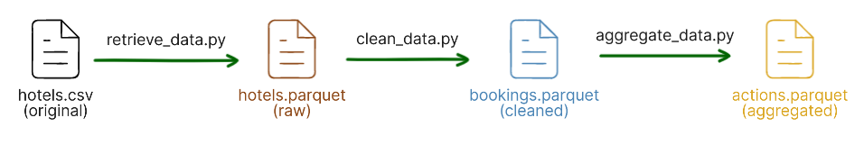
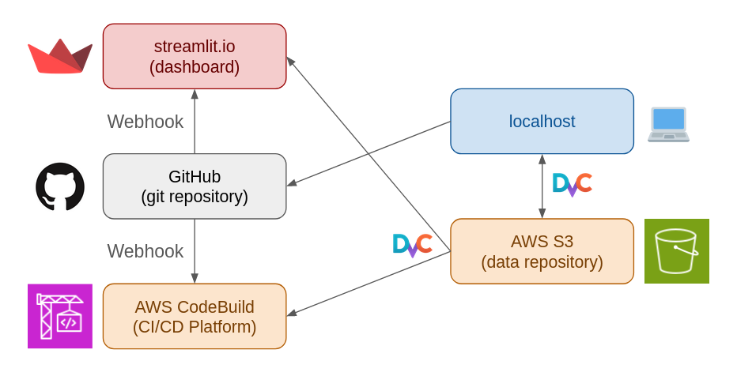

# Hotels Dashboards

[](https://stdiff-hotels-streamlit-app-m5ge83.streamlit.app/)

[](https://python-poetry.org/)

The aim of this project is to keep skills for dashboards and deployment. 

## Dataset

The data set comes from the papar [Antonio, Almeida and Nunes, 2019](https://doi.org/10.1016/j.dib.2018.11.126). 
The data files can be obtained at 
[tidytuesday](https://github.com/rfordatascience/tidytuesday/tree/master/data/2020/2020-02-11) repository.

## Dashboards 

### 📖 Hotel PMS Dashboard

A hotel PMS (Property Management System) is a system that manages information about hotel room reservations:
Who reserved a room of type X for the period T1 to T2, the status of the reservation, and so on.

This dashboard reproduces the PMS dashboard.

### 📊 Internal Dashboards

What kind of dashboards can we build for the company/hotel by utilizing the PMS data? 

- Hotel usage: Number of occupied rooms. Number of guests.
- Sales: Revenue. Revenue per occupied room (RevPOR).
- Marketing: Sales/Number of guests by country. Number of families. Marketing segments and distribution channels. 
- Cancellation: Cancellation rate (by country), survival rate, number of no-shows. 

## Data Pipeline

Our ETL pipeline follows so-called 
[medallion architecture](https://www.databricks.com/glossary/medallion-architecture).



- Bronze: `hotels.parquet`. This is just a parquet version of the original data (CSV).
- Silver: `bookings.parquet`. An analysis ready data. Several fields are added, so that we can easily analyze the data.
  A simple example is `arrival_date`. The original data has three columns for the dates: year, month, day.
  `arrival_date` is a compilation of the three columns.
- Gold: `actions.parquet`. This data shows the flows of reservations: `arrival` → `stay` → `departure`.

The data pipeline and the data assets are managed by [DVC](https://dvc.org/). 
The following command executes the data pipeline and reproduces data assets.

```shell
poetry run dvc repro
```

### Remark 

DVC is enabled in this repository. Because the remote repository is private, 
you have to replace it with your repository if you want to reproduce this project. 

## Infrastructure

- Codebase: GitHub
- Dashboard platform: [streamlit.io](https://streamlit.io/)
  - The platform retrieves automatically the source code from GitHub and deploys the newest version.
- CI Pipeline: [AWS CodeBuild](https://aws.amazon.com/codebuild/)
  - If I push a commit, CodeBuild pulls the latest codebase and executes unit tests
- Data Storage: S3
  - Dashboard, CI pipeline and local development environment pull the data from S3 via DVC. 



